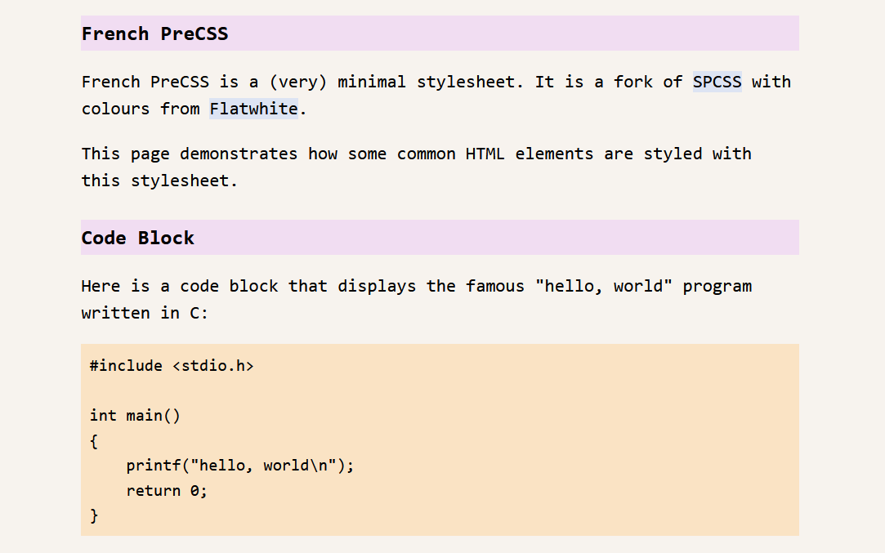

# French Pre(c)ss

French Pre(c)SS is a (very) minimal stylesheet.
It is a fork of [SPCSS](https://github.com/susam/spcss)
with colours from [Flatwhite](https://github.com/biletskyy/flatwhite-syntax).

## screenshot

See `index.html` for a full demo

## why?

From the original README:

>I often develop primarily text-based websites and webpages. The default
>style chosen by the web browsers while decent leaves a bit to be
>desired, so I often add a minimal stylesheet to improve the apperance of
>the document, hyperlinks, code blocks, blockquotes, tables, etc. This
>project shares the minimal stylesheet that I often rely on for styling
>simple websites and webpages.

I used the styling and colours from Flatwhite simply because I like them.

## license

This is free and open source software. You can use, copy, modify,
merge, publish, distribute, sublicense, and/or sell copies of it,
under the terms of the MIT License. See [LICENSE.md][L] for details.

This software is provided "AS IS", WITHOUT WARRANTY OF ANY KIND,
express or implied. See [LICENSE.md][L] for details.

[L]: LICENSE.md
